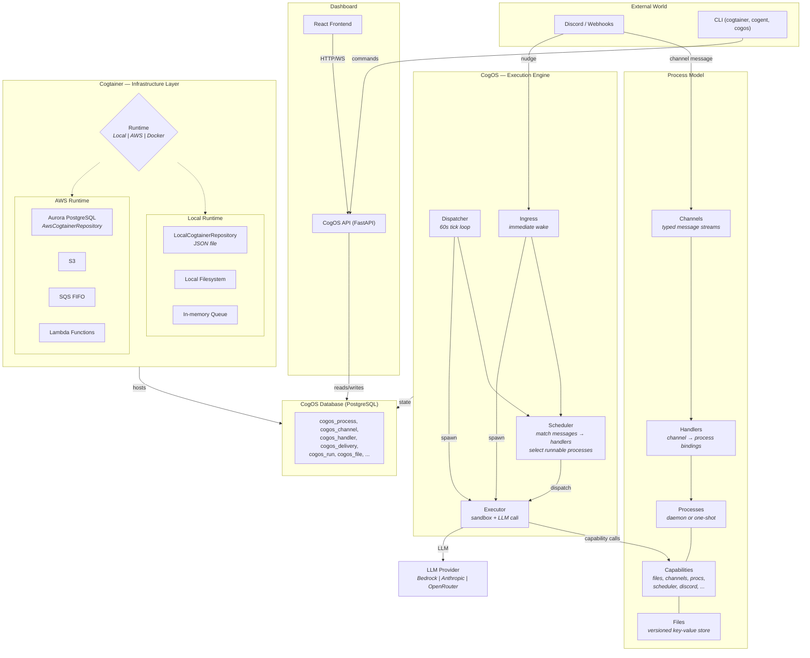
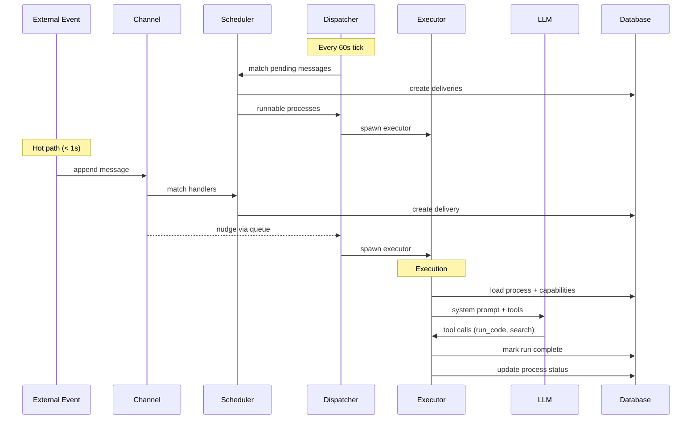

# CogOS

Autonomous software engineering agents built on the Viable System Model.

## Architecture



### Event Flow



## Concepts

- **Cogtainer** — a self-contained runtime environment that hosts cogents. Can run on AWS, locally, or in Docker.
- **Cogent** — an identity with its own database, processes, and capabilities, running inside a cogtainer.
- **CogOS** — the execution engine that runs processes for a cogent (executor, event-router, dispatcher).

Three CLI tools:

| CLI | Purpose | Example |
|-----|---------|---------|
| `cogtainer` | Manage cogtainer lifecycle | `cogtainer create dev --type local` |
| `cogent` | Manage cogents within a cogtainer | `cogent create alpha` |
| `cogos` | Operate a specific cogent | `cogos start` |

## Prerequisites

- Python 3.12+
- [uv](https://docs.astral.sh/uv/getting-started/installation/) package manager

## Quick Start — Local

```bash
# 1. Install
uv sync

# 2. Create a local cogtainer
uv run cogtainer create dev --type local --llm-provider bedrock --llm-model us.anthropic.claude-sonnet-4-20250514-v1:0

# 3. Create a cogent
uv run cogent create alpha

# 4. Start (boots image, runs init via dispatcher)
uv run cogos start

# 5. Check status
uv run cogos status

# 6. Start the dashboard
cd dashboard/frontend && npm ci && cd ../..
uv run cogos dashboard start
```

### LLM Providers

Local cogtainers support pluggable LLM providers:

```bash
# AWS Bedrock (requires AWS credentials)
uv run cogtainer create dev --type local --llm-provider bedrock --llm-model us.anthropic.claude-sonnet-4-20250514-v1:0

# OpenRouter
uv run cogtainer create dev --type local --llm-provider openrouter --llm-model anthropic/claude-sonnet-4 --llm-api-key-env OPENROUTER_API_KEY

# Direct Anthropic API
uv run cogtainer create dev --type local --llm-provider anthropic --llm-model claude-sonnet-4-20250514 --llm-api-key-env ANTHROPIC_API_KEY
```

### Environment Variables

| Variable | Purpose | Auto-resolved? |
|----------|---------|----------------|
| `COGTAINER` | Active cogtainer name | Yes, if only one exists |
| `COGENT` | Active cogent name | Yes, if only one exists |

When only one cogtainer or cogent exists, it's selected automatically. Otherwise, use `select` to persist your choice to a repo-local `.env` file:

```bash
uv run cogent select alpha    # writes COGTAINER and COGENT to .env
```

After selecting, all `cogos` commands pick up the selection automatically — no env var prefix needed.

## Deploying to AWS

```bash
# 1. Create an AWS cogtainer
uv run cogtainer create prod --type aws \
  --llm-provider bedrock \
  --llm-model us.anthropic.claude-sonnet-4-20250514-v1:0 \
  --region us-east-1 \
  --domain example.com

# 2. Deploy infrastructure (Aurora, ECS, ALB, ECR, EventBridge)
PYTHONPATH=src npx cdk deploy --app "python -m cogtainer.cdk.app" -c cogtainer_name=prod

# 3. Create a cogent (creates database, applies schema)
COGTAINER=prod uv run cogent create alpha

# 4. Deploy cogent stack (Lambdas, SQS, EventBridge rules)
PYTHONPATH=src npx cdk deploy --app "python -m cogtainer.cdk.app" \
  -c cogtainer_name=prod -c cogent_name=alpha \
  -c lambda_s3_bucket=<bucket> -c lambda_s3_key=lambda/<sha>/lambda.zip

# 5. Boot cogos
COGTAINER=prod COGENT=alpha uv run cogos start
```

### CI / CD

CI builds images and Lambda zips for all cogtainers defined in `cogtainers.ci.yml`:

```yaml
# cogtainers.ci.yml
ci_artifacts_bucket: my-ci-artifacts
cogtainers:
  prod:
    account_id: "123456789012"
    region: us-east-1
    ecr_repo: cogtainer-prod
    components: all
    cogents: [alpha, beta]
```

After CI builds, update a cogtainer:

```bash
# Update everything (Lambdas + ECS services)
uv run cogtainer update prod

# Update just Lambdas
uv run cogtainer update prod --lambdas --lambda-s3-bucket <bucket> --lambda-s3-key lambda/<sha>/lambda.zip

# Update just ECS services
uv run cogtainer update prod --services --image-tag executor-<sha>
```

## Configuration

All cogtainer config lives in `~/.cogos/cogtainers.yml`:

```yaml
cogtainers:
  dev:
    type: local
    data_dir: ~/.cogos/cogtainers/dev
    dashboard_be_port: 8100
    dashboard_fe_port: 5200
    llm:
      provider: bedrock
      model: us.anthropic.claude-sonnet-4-20250514-v1:0

  prod:
    type: aws
    account_id: "123456789012"
    region: us-east-1
    domain: example.com
    llm:
      provider: bedrock
      model: us.anthropic.claude-sonnet-4-20250514-v1:0

defaults:
  cogtainer: dev
```

## CLI Reference

### `cogtainer` — Cogtainer Lifecycle

```bash
uv run cogtainer create <name> --type aws|local|docker [options]
uv run cogtainer destroy <name>
uv run cogtainer list
uv run cogtainer status [<name>]
uv run cogtainer update <name> [--lambdas] [--services] [--all]
uv run cogtainer discover-aws [--region us-east-1]
uv run cogtainer compose <name> [--cogent <name>]  # docker-compose.yml
```

### `cogent` — Cogent Lifecycle

```bash
uv run cogent create <name>
uv run cogent destroy <name>
uv run cogent list
uv run cogent status [<name>]
```

### `cogos` — Cogent Operations

```bash
uv run cogos start                      # boot default image + start dispatcher
uv run cogos start <name>              # boot specific image
uv run cogos start --clean             # wipe first
uv run cogos status                     # show processes, files, capabilities
uv run cogos process list               # list processes
uv run cogos process run <name> --executor local  # run a process locally
uv run cogos process create <name> --mode daemon --content "..."
uv run cogos file list                  # list files
uv run cogos file get <key>             # show file content
uv run cogos channel send <name> --payload '{...}'
uv run cogos dashboard start            # start local dashboard
uv run cogos dashboard stop
uv run cogos shell                      # interactive shell
```

## Dashboard

Each cogtainer gets unique dashboard ports (auto-assigned on creation):

```bash
cd dashboard/frontend && npm ci && cd ../..
COGENT=alpha uv run cogos dashboard start    # starts on cogtainer's configured ports
COGENT=alpha uv run cogos dashboard stop
COGENT=alpha uv run cogos dashboard reload
```

## Troubleshooting

**LLM calls fail:** Ensure AWS credentials are configured and Bedrock model access is enabled. For OpenRouter, verify `OPENROUTER_API_KEY` is set.

**Multiple cogtainers/cogents:** Set `COGTAINER` and `COGENT` env vars to disambiguate.

**Dashboard port conflict:** Each cogtainer gets unique ports. Check with `uv run cogtainer status <name>`.

## References

- [AGENTS.md](AGENTS.md) — repo operating notes and deployment reference
- [docs/deploy.md](docs/deploy.md) — deployment guide
- [docs/cogos/guide.md](docs/cogos/guide.md) — CogOS architecture
- [docs/cogtainer/](docs/cogtainer/) — cogtainer design and CLI reference
